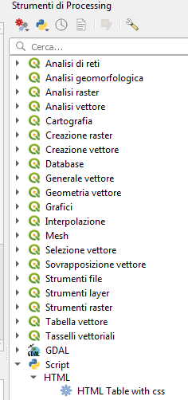
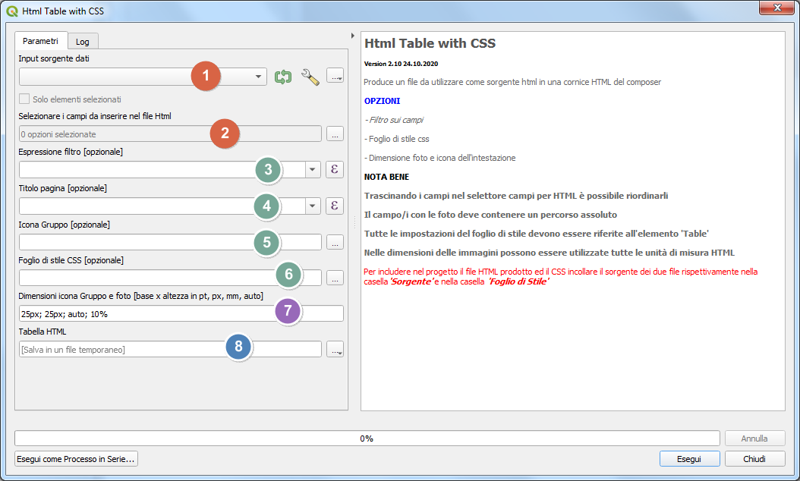

#  HTML-and-CSS 
## Qgis Processing plugin

### 1. - Finestra processing
Il plugin, una volta caricato, compare negli script di processing nella cartella HTML



Il plugin permette la composizione di una pagina HTML con i dati da una fonte tra quelle compatibili.



1. sorgente dati, eventualmente anche filtrati e/o solo selezionati se da mappa;
2. selettore campi dati da inserire nell'html;
3. [opzionale] espressione filtro;
4. [opzionale] titolo in testa alla pagina html;
5. [opzionale] icona o immagine in alto a sinistra;
6. [opzionale] css da includere nell'html;
7. dimensioni icona e foto;
8. scelta tra link con percorso assoluto (default) o relativo;
9. file in uscita.

Il plugin riconosce i campi data e quelli in cui è memorizzata l'immagine o le immagini purchè con estensione di file immagine (gif; jpeg; jpg; png; svg).

I campi selezionati possono essere riordinati a piacimento.

Le dimensioni dell'icona e delle immagini possono essere espresse in tutte le unità di misura previste dall'html.

Il file css determina tutte le caratteristiche estetiche del file prodotto, riferendosi sempre all'elemento 'Table', alt tag **'b'** per il titolo ed al tag **'div'** per l'immagine o l'icona in intestazione.

I file prodotti, se temporanei, avranno sempre percorsi assoluti, altrimenti non sarebbero corretti, se salvati possono avere sia percorsi assoluti che relativi.

Per poter eventualmente traferire il progetto con i file html relativi, tutti i file devono risiedere in sottocartelle della cartella di progetto.

### 2. - OPZIONI

1. Espressione filtro: un filtro componibile nativo di QGis;
2. Titolo: una qualsiasi combinazione alfanumerica nella casella di testo, senza apici, il sistema la mette in rosso, ma funziona perfettamente; altrimenti una qualsiasi composizione entro il solito calcolatore, ovviamente si tratta di una scritta non dinamica;
3. Icona o immagine: una qualsiasi immagine tra quelle compatibili:
4. CSS: questa è la parte più interessante dato che permette una personalizzazione accurata della pagina html prodotta. Come anzidetto i tag utilizzati sono **'Table'**, **'b'** e **'div'**, per generare comodamente il css vi sono diversi tools gratuiti online tra cui https://divtable.com/table-styler/ che permette con pochi passaggi di ottenere risultati veramente notevoli e la cui unica limitazione è la fantasia dell'autore. Il sito da anche la possibilità di definire ogni singolo aspetto dell'impaginazione.
   
### 3. CSS - ESEMPIO ARIAL FIXED
A titolo di esempio ecco un css:
```
`/* Personalizzazione Titolo */
b {
	font-family: Arial;
	font-size: 24pt;
	letter-spacing: 0.1px;
	word-spacing: 0.2px;
	color: #000000;
}
/* Caratteristiche generali della tabella */
table.Table {
	font-family: Arial;
	font-size: 12pt;
	letter-spacing: 0.1px;
	word-spacing: 0.2px;
	color: #000000;
	font-weight: normal;
	text-decoration: none;
	font-style: normal;
	font-variant: normal;
	text-transform: none;
	border: 1.5px solid #674d3c;
	background-color: #fff2df;
	border-collapse: collapse;
	width: 145mm;
}
/* Caratteristiche dell'intestazione  */
table.Table thead th{
	font-size: 8pt;
	background: #fff2df;
	background: -moz-linear-gradient(top, #fff2df 0%, #d9ad7c 66%, #a2836e 100%);
	background: -webkit-linear-gradient(top, #fff2df 0%, #d9ad7c 66%, #a2836e 100%);
	background: linear-gradient(to bottom, #a2836e 0%, #a2836e 66%, #a2836e 100%);
	border-bottom: 0px solid #444444;
	text-align: center;
}
/* Caratteristiche generali delle colonne */
table.Table td {
	border: 1.5px solid #674d3c;
	padding: 1px 1px;
	font-size: 12px;
}
/* Caratteristiche della prima colonna*/
table.Table td:first-child {
	text-align: center;
	width: 5mm;
	font-size: 12px;
}
/* Caratteristiche della seconda colonna notare 'first-child + td' vale anche 'nth-child(2)'*/
table.Table td:first-child + td {
	text-align: center;
	width: 20mm;
	font-size: 12px;
}
/* Caratteristiche della terza colonna notare 'first-child + td + td' vale anche 'nth-child(3)'*/
table.Table td:first-child + td + td {
	text-align: center;
	font-size: 8pt;
	width: 50mm;
}
/* Caratteristiche delle colonne successive notare 'nth-child(even)'*/
table.Table td:nth-child(even) {
	text-align: center;
	width: 50mm;
}
/* Caratteristiche delle */
table.Table th {
	color: #fff2df;
	border: 1.5px solid #674d3c;
	padding: 1px 1px;
}
/* Caratteristiche generiche del corpo dell'html*/
table.Table tbody td {
	font-size: 8pt;
}
table.Table tr:nth-child(even){
	background: #d9ad7c;
}
/* Caratteristiche del div entro cui sta l'immagine*/
div {
	font-family: Arial, Helvetica, sans-serif;
	font-size: 15pt; color: #674d3c;
	text-align: left;
	line-height: 1.5;
}`
```
come si può notare la larghezza **width** delle colonne e la larghezza della tabella sono espresse in mm e questo è veramente utile per produrre impaginazioni precise.

# 4. Dati di esempio

# 5. Videotutorial

