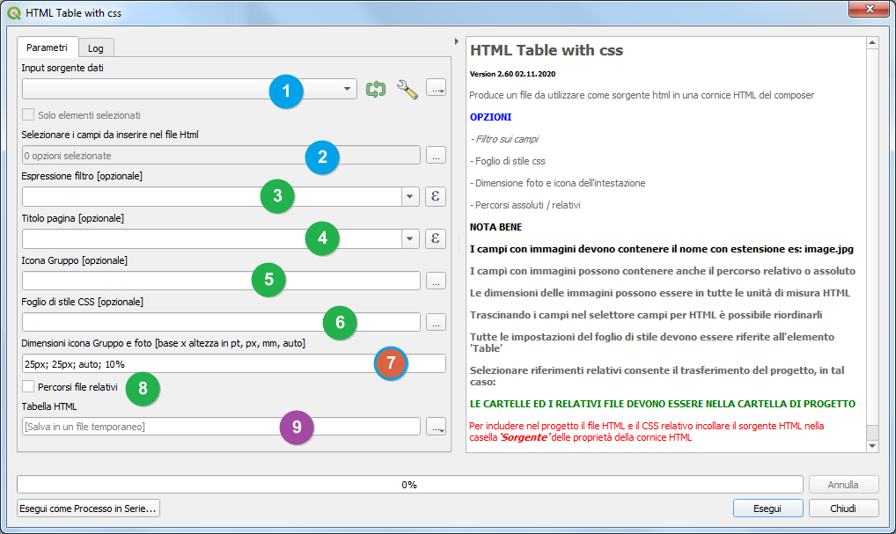

# 1. HTML-and-CSS
Qgis Processing plugin

Il plugin consente la creazione di una pagina HTML da una fonte dati tra quelle compatibili.

1. sorgente dati, eventualmente anche solo selezionati se da mappa;
2. selettore campi dati da inserire nell'html;
3. [opzionale] espressione filtro;
4. [opzionale] titolo in testa alla pagina html;
5. [opzionale] icona o immagine accanto al titolo
6. [opzionale] css da includere nell'html;
7. dimensioni icona e foto;
8. file in uscita.

Il plugin riconosce i campi data e quelli in cui è memorizzata l'immagine o le immagini purchè con percorso assoluto.

I campi selezionati possono essere riordinati a piacimento.

Le dimensioni dell'icona e delle immagini possono essere espresse in tutte le unità di misura previste dall'html.

Il file css determina tutte le caratteristiche estetiche del file prodotto, riferendosi sempre all'elemento 'Table'.